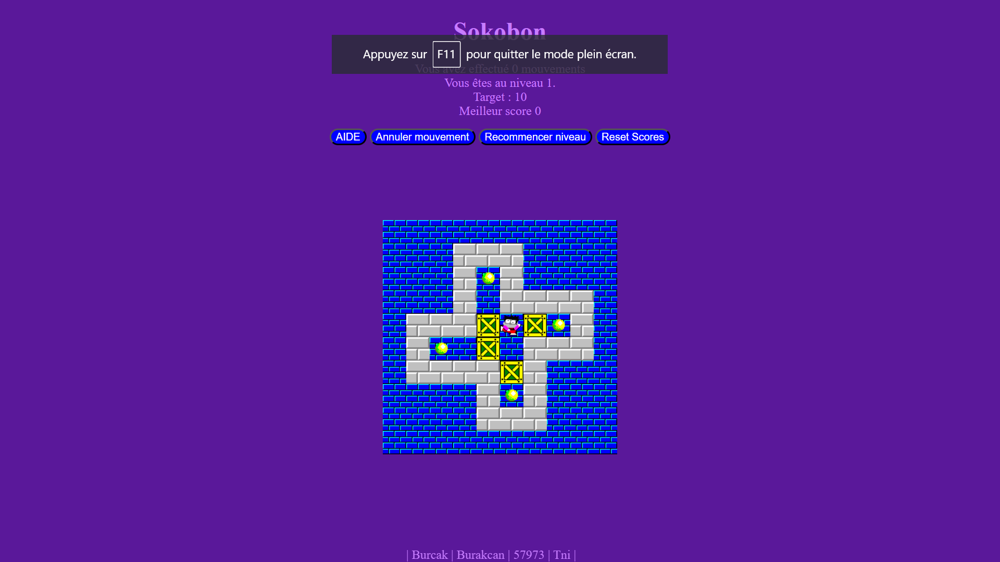

# Sokoban Game

## Description
Sokoban is a classic 2D puzzle platformer game where the player pushes boxes to their designated locations within a maze. This project is a Sokoban game implemented using JavaScript, jQuery, HTML, and CSS.

## Features
- Classic Sokoban gameplay with intuitive controls.
- Multiple levels of increasing difficulty.

## Rules
For the rules of Sokoban, please refer to [this link](https://en.wikipedia.org/wiki/Sokoban#Gameplay).

## Live preview
 [Test it !](https://sokoban-gilt.vercel.app/)

## Incoming 
- Responsive design...
- Button controls for mobile devices ...

## Installation
1. Clone this repository to your local machine.
2. Run the index.html file and enjoy !
